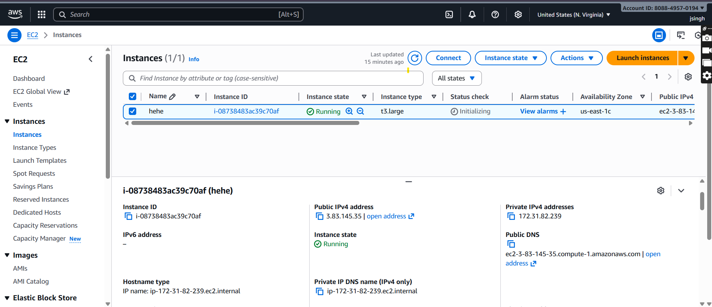
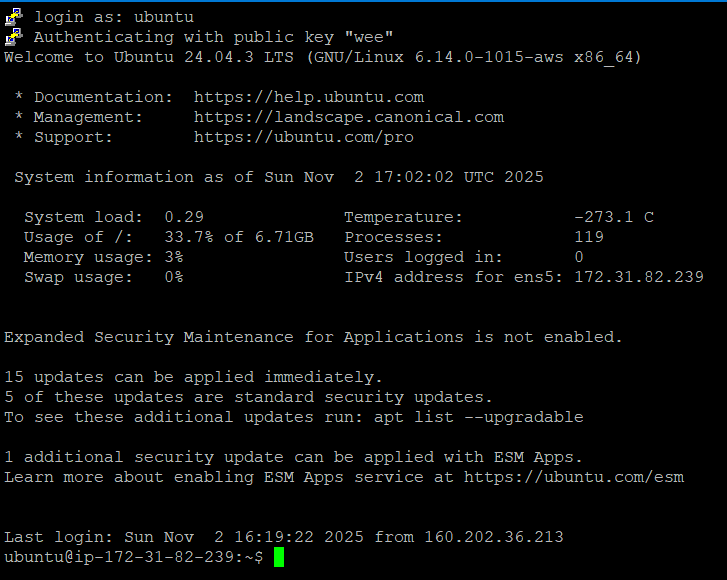
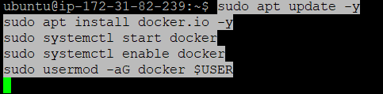
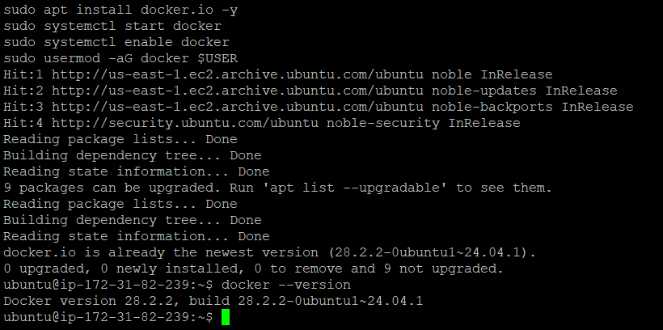
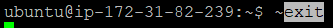
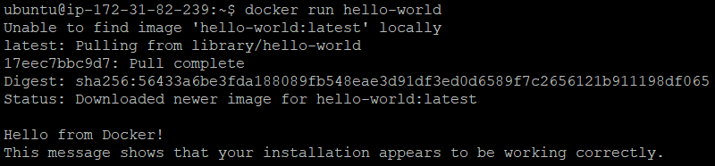

# Installing Docker

# VM Running 

# Putty Working

# Downloading Docker

# Docker Installed

# Exit to check if it's working

# After Exiting, Open Putty with same process, Then run the following command 

# Docker is running successfully

